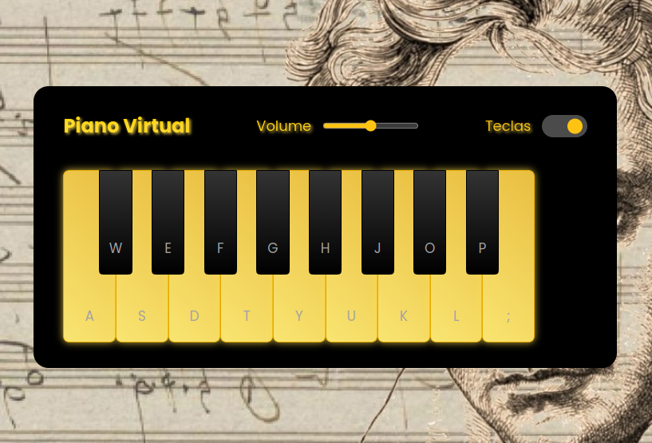

# Jogo Chaves - Acerte o Personagem

Bem-vindo ao **Jogo Detona Chaves**, um jogo simples onde o objetivo é acertar o personagem Chaves clicando com o mouse. Este jogo foi desenvolvido com HTML, CSS e JavaScript (fins educacionais).

## Instruções

1. Abra o arquivo `index.html` no seu navegador.
2. Clique no quadrado que contém a imagem do personagem Chaves quando ele aparecer.
3. Cada acerto adiciona pontos ao seu resultado.
4. O jogo tem um limite de tempo. Você tem que acertar o máximo de vezes antes que o tempo acabe.

## Estrutura do Projeto

- **HTML (`index.html`):** Contém a estrutura básica da página.
- **CSS (`style.css`):** Define o estilo e a aparência do jogo.
- **JavaScript (`script.js`):** Contém a lógica do jogo.

## Desenvolvedor

Este projeto foi desenvolvido por Iago Vinicius Russi Novaes.

**Nota:** As imagens e sons usados neste projeto são para fins educacionais.

Divirta-se jogando! 😄
